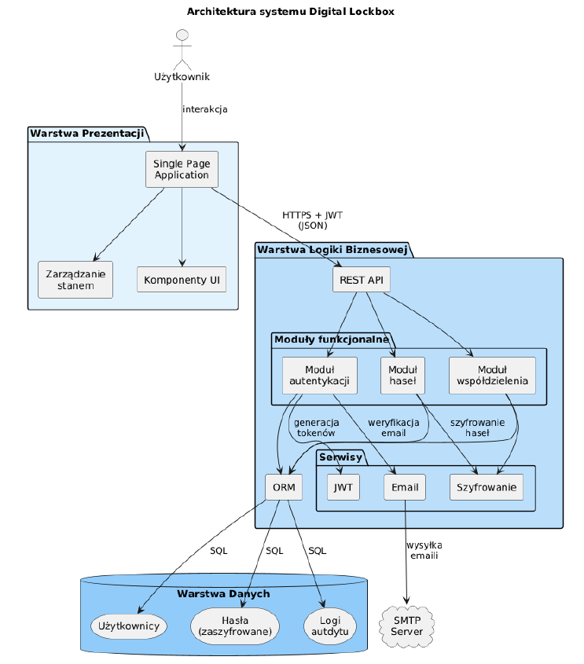
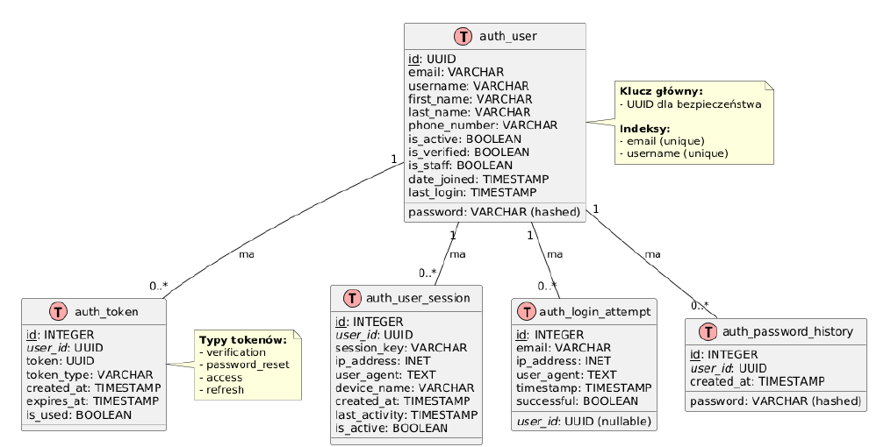
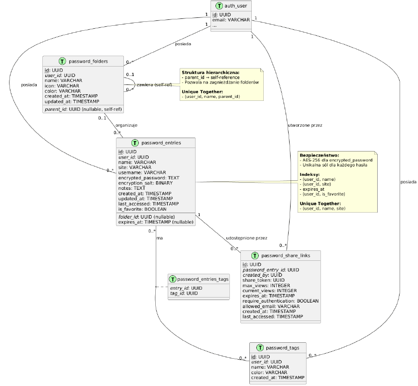
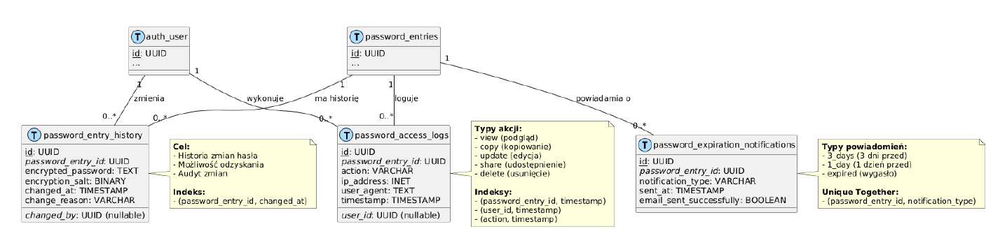

# Dokumentacja Project Managera
# DigitalLockbox – Secure Password Manager

---

## Informacje o projekcie

| Pole | Wartość |
|---|---|
| **Nazwa projektu** | DigitalLockbox |
| **Typ** | Aplikacja webowa (SPA) |
| **Czas realizacji** | 20.04.2026 – 31.05.2026 (~6 tygodni) |
| **Repozytorium** | https://github.com/bartbrassica/projekt-zespolowy-wspa |
| **Metodyka** | Agile / Scrum (Planning + Daily Stand-up + Retrospektywa) |

---

## Zespół

| Imię i nazwisko | Rola Scrum | Zakres odpowiedzialności |
|---|---|---|
| Amanda Krasnowska-Szymańska | Product Owner / Project Manager | Wymagania, backlog, harmonogram, dokumentacja PM |
| Bartłomiej Kapuśniak | Developer | Backend (Django Ninja), Frontend (React/TS), Docker |
| Agata Smelkowska | Tester / QA | Testy manualne, testy automatyczne, raporty błędów |

---

## Wizja projektu

DigitalLockbox to webowy menedżer haseł z szyfrowaniem end-to-end, zaprojektowany z myślą o dostępności i bezpieczeństwie klasy wojskowej (Military-Grade Security). Misją projektu jest demokratyzacja bezpieczeństwa cyfrowego — dostarczenie intuicyjnego narzędzia, które nie wymaga od użytkownika specjalistycznej wiedzy technicznej.

Projekt odpowiada na realny problem: przeciętny użytkownik posiada ponad 100 kont w różnych serwisach, a 69% z nich stosuje to samo hasło w wielu miejscach. Istniejące rozwiązania komercyjne (LastPass, 1Password, Dashlane) kosztują 36–60 USD rocznie i mają zamknięty kod źródłowy. DigitalLockbox wypełnia tę lukę: open-source + nowoczesny interfejs + pełna kontrola użytkownika nad danymi.

**Kluczowe założenia:**
- Harmonia między UX a kryptografią — bezpieczeństwo musi być naturalne, nie uciążliwe
- Bezpieczne zarządzanie tożsamością cyfrową z pełnym audit trail
- Skalowalna architektura trójwarstwowa: SPA (React/TS) + REST API (Django Ninja) + PostgreSQL
- Weryfikowalność bezpieczeństwa dzięki otwartemu kodowi źródłowemu

---

## Wymagania systemu

### Wymagania funkcjonalne

| ID | Nazwa | Opis |
|---|---|---|
| FR-1 | Rejestracja użytkownika | Rejestracja konta z walidacją siły hasła (min. 8 znaków, wielka/mała litera, cyfra, znak specjalny) |
| FR-2 | Logowanie | Logowanie za pomocą adresu e-mail i hasła |
| FR-3 | Weryfikacja konta | Wysyłanie e-maila weryfikacyjnego i weryfikacja konta tokenem |
| FR-4 | Zarządzanie tokenami | Wydawanie tokenów JWT (Access i Refresh) i ich odświeżanie |
| FR-5 | Wylogowanie | Wylogowanie z unieważnieniem tokenów |
| FR-6 | Reset hasła | Reset hasła przez e-mail i token czasowy (ważny 24h) |
| FR-7 | Zmiana hasła | Zmiana hasła po zalogowaniu (wymaga podania obecnego hasła) |
| FR-8 | Zarządzanie sesjami | Lista aktywnych sesji i możliwość ich zdalnego zakończenia |
| FR-9 | Tworzenie haseł | Dodawanie wpisów (nazwa, URL, login, hasło szyfrowane) |
| FR-10 | Szyfrowanie danych | Szyfrowanie i odszyfrowywanie haseł hasłem głównym |
| FR-11 | Aktualizacja haseł | Edycja wpisów + historia zmian |
| FR-12 | Usuwanie haseł | Usuwanie pojedyncze i masowe |
| FR-13 | Wyszukiwanie | Wyszukiwanie i filtrowanie haseł |
| FR-14 | Kopiowanie danych | Kopiowanie do schowka z automatycznym czyszczeniem po 30 sek. |
| FR-15 | Generator haseł | Generowanie bezpiecznych haseł z opcjami konfiguracji |
| FR-16 | Foldery | Zarządzanie folderami (hierarchia, przenoszenie, kolor, ikona) |
| FR-17 | Tagi | Tworzenie i przypisywanie tagów (kolor, nazwa) |
| FR-18 | Ulubione | Oznaczanie wpisów jako ulubione |
| FR-19 | Wygasanie haseł | Ustawianie dat wygaśnięcia + powiadomienia e-mail |
| FR-20 | Eksport danych | Eksport do JSON/CSV (wymaga hasła głównego) |
| FR-21 | Import danych | Import z JSON/CSV z mapowaniem pól i wykryciem duplikatów |
| FR-22 | Udostępnianie | Generowanie bezpiecznych linków z limitem dostępu i czasem wygaśnięcia |

### Wymagania niefunkcjonalne

| ID | Nazwa | Opis |
|---|---|---|
| NFR-1 | Szyfrowanie end-to-end | PBKDF2-HMAC-SHA256 (200k iteracji) + Fernet (AES-128-CBC) |
| NFR-2 | Haszowanie hasła | Hasło główne haszowane algorytmem Argon2 |
| NFR-3 | Autoryzacja | JWT ES512 (Access: 15 min, Refresh: 14 dni) |
| NFR-4 | Replay attack | Refresh Token jednorazowy (Single Use Token) |
| NFR-5 | Logowanie zdarzeń | Rejestrowanie operacji (IP, User Agent, akcja, timestamp) |
| NFR-6 | Walidacja haseł | Wymaganie silnych haseł przy rejestracji i zmianie |
| NFR-7 | Baza danych | PostgreSQL |
| NFR-8 | Optymalizacja | Indeksy i optymalizacja zapytań |
| NFR-9 | Wydajność | Odpowiedzi API < 1 sekunda |
| NFR-10 | Responsywność | UI responsywny na różnych urządzeniach |
| NFR-11 | Walidacja formularzy | Walidacja po stronie klienta i serwera |
| NFR-12 | Komunikaty | System powiadomień (alerts z auto-zamykaniem) |
| NFR-13 | Architektura klienta | Aplikacja typu SPA |

---

## Stos technologiczny

| Warstwa | Technologia | Uzasadnienie |
|---|---|---|
| **Backend** | Python 3.12 + Django + Django Ninja | Bezpieczny ORM, automatyczna dokumentacja OpenAPI (Swagger) |
| **Frontend** | React + TypeScript + Tailwind CSS | Architektura komponentowa SPA, minimalizacja błędów runtime |
| **Baza danych** | PostgreSQL | Niezawodność, zaawansowane indeksowanie, pełna zgodność SQL |
| **Szyfrowanie** | PBKDF2-HMAC-SHA256 + Fernet (AES-128-CBC) + Argon2 | Standard kryptograficzny klasy wojskowej |
| **Autoryzacja** | JWT ES512 | Architektura bezstanowa, ochrona przed replay attack |
| **Konteneryzacja** | Docker + Docker Compose | Spójność środowiska, uproszczone wdrożenie |
| **Testy** | pytest + pytest-django + coverage | TDD, izolacja testów, raport pokrycia kodu |
| **Kontrola wersji** | Git + GitHub | Zarządzanie wersjami, dokumentacja sprintów w Issues |

---

## Architektura systemu

System zbudowany jest w oparciu o klasyczną architekturę trójwarstwową:

- **Warstwa prezentacji** — SPA (React/TypeScript), komunikacja przez REST API (HTTPS + JWT)
- **Warstwa logiki biznesowej** — Django Ninja REST API: moduł autentykacji, moduł zarządzania hasłami, moduł współdzielenia, moduł audytu
- **Warstwa danych** — PostgreSQL: tabele użytkowników (`auth_*`), tabele haseł (`password_*`), tabele audytowe

### Diagram architektury systemu



> *Rysunek 1 — Diagram architektury systemu DigitalLockbox*

### Diagramy ERD bazy danych



> *Rysunek 2 — ERD tabel użytkowników: `auth_user`, `auth_token`, `auth_user_session`, `auth_login_attempt`, `auth_password_history`*



> *Rysunek 3 — ERD tabel haseł: `password_entries`, `password_folders`, `password_tags`, `password_share_links`*



> *Rysunek 4 — ERD tabel audytowych: `password_access_logs`, `password_entry_history`, `password_expiration_notifications`*

---

## Metodyka pracy – Agile/Scrum

Projekt realizowany jest zgodnie z metodyką Agile. Każdy sprint obejmuje trzy obowiązkowe zdarzenia dokumentowane w repozytorium GitHub:

| Zdarzenie | Kiedy? | Cel | Główne pytanie |
|---|---|---|---|
| **Planning** | Początek sprintu | Ustalenie celu i wybór zadań z backlogu | Co będziemy robić? |
| **Daily Stand-up** | Codziennie (~15 min) | Synchronizacja, wykrycie blokerów | Jak nam idzie dzisiaj? |
| **Retrospektywa** | Koniec sprintu | Ocena współpracy, wyznaczenie action items | Jak możemy pracować lepiej? |

Każde zdarzenie dokumentowane jest w repozytorium GitHub (Issues, Discussions lub pliki `.md` w folderze `docs/`).

---

## Product Backlog

Lista wszystkich funkcjonalności priorytetyzowana metodą MoSCoW. Estymacja w Story Points — skala Fibonacciego: 1, 2, 3, 5, 8.

| ID | User Story | Priorytet | SP | Sprint |
|---|---|---|---|---|
| US-1 | Jako użytkownik chcę się zarejestrować z walidacją hasła, aby bezpiecznie założyć konto | Must Have | 3 | 2 |
| US-2 | Jako użytkownik chcę się logować e-mailem i hasłem, aby uzyskać dostęp do aplikacji | Must Have | 3 | 2 |
| US-3 | Jako użytkownik chcę zweryfikować konto przez e-mail, aby aktywować dostęp | Must Have | 2 | 2 |
| US-4 | Jako użytkownik chcę resetować hasło przez e-mail, aby odzyskać dostęp do konta | Must Have | 3 | 2 |
| US-5 | Jako użytkownik chcę się wylogować i unieważnić sesję, aby zabezpieczyć konto | Must Have | 2 | 2 |
| US-6 | Jako użytkownik chcę zmieniać hasło główne po zalogowaniu, aby je regularnie aktualizować | Must Have | 2 | 2 |
| US-7 | Jako użytkownik chcę zarządzać aktywnymi sesjami, aby zdalnie wylogować się z innych urządzeń | Should Have | 3 | 2 |
| US-8 | Jako użytkownik chcę dodawać zaszyfrowane hasła, aby bezpiecznie je przechowywać | Must Have | 5 | 4 |
| US-9 | Jako użytkownik chcę edytować hasła z historią zmian, aby utrzymywać aktualną bazę | Must Have | 3 | 4 |
| US-10 | Jako użytkownik chcę usuwać hasła (pojedynczo i masowo), aby utrzymać porządek | Must Have | 2 | 4 |
| US-11 | Jako użytkownik chcę wyszukiwać i filtrować hasła, aby szybko je znajdować | Must Have | 3 | 4 |
| US-12 | Jako użytkownik chcę kopiować hasło do schowka z auto-czyszczeniem, aby nie ujawniać go na ekranie | Must Have | 2 | 4 |
| US-13 | Jako użytkownik chcę generować silne hasła, aby zwiększyć bezpieczeństwo kont | Should Have | 2 | 4 |
| US-14 | Jako użytkownik chcę organizować hasła w foldery i tagi, aby utrzymać porządek | Should Have | 5 | 8 |
| US-15 | Jako użytkownik chcę oznaczać hasła jako ulubione, aby mieć szybki dostęp do najważniejszych | Should Have | 1 | 4 |
| US-16 | Jako użytkownik chcę ustawiać daty wygaśnięcia i otrzymywać powiadomienia, aby dbać o higienę haseł | Should Have | 3 | 4 |
| US-17 | Jako użytkownik chcę eksportować i importować hasła (JSON/CSV), aby migrować dane między urządzeniami | Could Have | 3 | 4 |
| US-18 | Jako użytkownik chcę udostępniać hasło bezpiecznym linkiem z limitem dostępu, aby przekazać je bez wysyłania niezaszyfrowanego tekstu | Could Have | 5 | 4 |

### Kryteria akceptacji (Given-When-Then)

**US-1: Rejestracja użytkownika**

```
Scenario: Poprawna rejestracja
  Given użytkownik jest na stronie rejestracji
  When wpisuje poprawny e-mail i hasło spełniające wymagania siły
  And klika "Zarejestruj się"
  Then konto zostaje utworzone ze statusem is_verified=False
  And użytkownik otrzymuje e-mail z linkiem weryfikacyjnym (ważnym 72h)

Scenario: Hasło zbyt słabe
  Given użytkownik jest na stronie rejestracji
  When wpisuje hasło bez znaku specjalnego
  Then widzi komunikat "Hasło musi zawierać znak specjalny"
  And formularz nie zostaje wysłany
```

**US-2: Logowanie**

```
Scenario: Poprawne logowanie
  Given użytkownik ma zweryfikowane konto
  When wpisuje poprawny e-mail i hasło i klika "Zaloguj się"
  Then zostaje przekierowany do menedżera haseł
  And otrzymuje Access Token (15 min) i Refresh Token (14 dni)

Scenario: Logowanie na niezweryfikowane konto
  Given użytkownik nie kliknął linku weryfikacyjnego
  When próbuje się zalogować poprawnymi danymi
  Then widzi komunikat "Zweryfikuj adres e-mail przed logowaniem"
```

**US-8: Dodawanie zaszyfrowanego hasła**

```
Scenario: Poprawne dodanie hasła
  Given użytkownik jest zalogowany i podał hasło główne
  When wypełnia formularz (nazwa, URL, login, hasło) i klika "Zapisz"
  Then hasło zostaje zaszyfrowane algorytmem PBKDF2+Fernet z unikalną solą
  And wpis pojawia się na liście haseł użytkownika

Scenario: Próba dodania bez hasła głównego
  Given użytkownik jest zalogowany
  When próbuje dodać hasło bez podania hasła głównego
  Then system wyświetla prośbę o podanie hasła głównego przed kontynuacją
```

**US-12: Kopiowanie hasła do schowka**

```
Scenario: Kopiowanie z auto-czyszczeniem
  Given użytkownik widzi listę haseł i kliknął "Kopiuj"
  When poda poprawne hasło główne
  Then odszyfrowane hasło trafia do schowka systemowego
  And po 30 sekundach schowek jest automatycznie czyszczony
  And operacja zostaje zalogowana w audit logu (IP, User Agent, timestamp)
```

---

## Sprinty

---

### Sprint 1 – Analiza wymagań i projektowanie
**Okres:** 20.04.2026 – 24.04.2026 (5 dni) | **Pula:** 13 SP

---

#### 🗓 Planning

**Cel sprintu:** Określenie pełnego zakresu projektu, zaprojektowanie architektury i przygotowanie środowiska pracy.

**Sprint Backlog:**

| Zadanie | Odpowiedzialny | SP | Powiązane |
|---|---|---|---|
| Zebranie i dokumentacja wymagań funkcjonalnych (FR-1–22) | Amanda | 2 | US-1–US-18 |
| Zebranie i dokumentacja wymagań niefunkcjonalnych (NFR-1–13) | Amanda | 2 | NFR-1–NFR-13 |
| Projekt architektury systemu (backend/frontend/baza) | Bartłomiej | 3 | NFR-7, NFR-13 |
| Projekt modelu bazy danych (ERD) | Bartłomiej | 3 | NFR-7, NFR-8 |
| Konfiguracja repozytorium GitHub, branching strategy | Bartłomiej | 1 | — |
| Przygotowanie dokumentacji wstępnej (wizja, README) | Amanda | 2 | — |

**Deklaracja zespołu:** Na koniec sprintu posiadamy zatwierdzoną dokumentację wymagań, skonfigurowane repozytorium i uzgodnioną architekturę systemu.

---

#### 📋 Daily Stand-up

| Dzień | Co zrobiono? | Co planujemy? | Blokery? |
|---|---|---|---|
| 20.04 (pon) | Kick-off zespołu, omówienie zakresu | Amanda: szkic FR/NFR; Bartek: research technologii | Brak |
| 21.04 (wt) | Amanda: draft FR/NFR; Bartek: projekt ERD | Finalizacja wymagań; setup repo | Brak |
| 22.04 (śr) | Wymagania ukończone; repo skonfigurowane | Bartek: diagram architektury; Amanda: wizja projektu | Brak |
| 23.04 (czw) | Diagram architektury gotowy | Przegląd dokumentów przez cały zespół | Brak |
| 24.04 (pt) | Przegląd i zatwierdzenie dokumentacji | Przygotowanie do Sprintu 2 i 3 | Brak |

---

#### 🔄 Retrospektywa

**Co poszło dobrze:**
- Szybkie uzgodnienie zakresu projektu przez cały zespół
- Sprawna konfiguracja repozytorium GitHub

**Co można poprawić:**
- Wymagania były zbyt ogólne — warto wcześniej konsultować szczegóły techniczne z programistą

**Action items:**
- Bartek konsultuje szczegóły techniczne wymagań z Amandą na bieżąco w kolejnych sprintach
- Agata zapoznaje się z wymaganiami i przygotowuje wstępny plan testów manualnych

---

### Sprint 2 – Backend: uwierzytelnianie
**Okres:** 25.04.2026 – 10.05.2026 (16 dni) | **Pula:** 25 SP

---

#### 🗓 Planning

**Cel sprintu:** Zaimplementowanie pełnego systemu uwierzytelniania po stronie serwera — wszystkie endpointy API gotowe i przetestowane manualnie.

**Sprint Backlog:**

| Zadanie | Odpowiedzialny | SP | Powiązane |
|---|---|---|---|
| Endpoint rejestracji z walidacją siły hasła | Bartłomiej | 3 | US-1, FR-1, NFR-6 |
| Endpoint logowania (e-mail + hasło) | Bartłomiej | 3 | US-2, FR-2 |
| System weryfikacji konta przez e-mail (token UUID, ważny 72h) | Bartłomiej | 2 | US-3, FR-3 |
| Implementacja JWT ES512 (Access 15 min + Refresh 14 dni) | Bartłomiej | 3 | FR-4, NFR-3, NFR-4 |
| Endpoint wylogowania (unieważnienie Refresh Token) | Bartłomiej | 2 | US-5, FR-5 |
| Endpoint resetu hasła (e-mail + token ważny 24h) | Bartłomiej | 3 | US-4, FR-6 |
| Endpoint zmiany hasła po zalogowaniu | Bartłomiej | 2 | US-6, FR-7 |
| Zarządzanie sesjami (lista aktywnych + zdalne zakończenie) | Bartłomiej | 3 | US-7, FR-8 |
| Haszowanie hasła głównego algorytmem Argon2 | Bartłomiej | 2 | NFR-2 |
| Logowanie zdarzeń (IP, User Agent, akcja, timestamp) | Bartłomiej | 2 | NFR-5 |
| Testy manualne endpointów auth | Agata | — | FR-1–FR-8 |

**Deklaracja zespołu:** Na koniec sprintu wszystkie endpointy uwierzytelniania działają poprawnie i są potwierdzone przez Agatę.

---

#### 📋 Daily Stand-up

| Dzień | Co zrobiono? | Co planujemy? | Blokery? |
|---|---|---|---|
| 25.04 (sob) | Sprint planning, podział zadań | Bartek: endpoint rejestracji | Brak |
| 28.04 (wt) | Endpoint rejestracji gotowy | Bartek: logowanie + JWT ES512 | Brak |
| 30.04 (czw) | JWT ES512 zaimplementowane | Bartek: weryfikacja e-mail; Agata: przegląd wymagań | Brak |
| 05.05 (wt) | Weryfikacja e-mail + reset hasła gotowe | Bartek: sesje + zmiana hasła; Agata: pierwsze testy | Brak |
| 07.05 (czw) | Sesje i zmiana hasła ukończone | Bartek: Argon2 + logi audytu; Agata: testy FR-1–FR-5 | Brak |
| 09.05 (sob) | Wszystkie endpointy gotowe | Agata: finalne testy manualne | Brak |
| 10.05 (nd) | Testy manualne zakończone | Sprint review + retro | Brak |

---

#### 🔄 Retrospektywa

**Co poszło dobrze:**
- Implementacja JWT ES512 i Argon2 przebiegła sprawnie dzięki dobrej dokumentacji bibliotek
- Agata wykryła edge case (logowanie na niezweryfikowane konto) zanim trafiło do frontendu

**Co można poprawić:**
- Sprint 16-dniowy — trudno utrzymać regularny rytm daily stand-upów
- Brak bieżącej komunikacji Bartek–Agata w trakcie implementacji

**Action items:**
- Stała godzina daily: 20:00 każdego dnia roboczego, log w GitHub Discussions
- Agata testuje ukończone endpointy na bieżąco, nie czeka na koniec sprintu

---

### Sprint 3 – Frontend: uwierzytelnianie
**Okres:** 25.04.2026 – 10.05.2026 (16 dni, równolegle ze Sprintem 2) | **Pula:** 18 SP

---

#### 🗓 Planning

**Cel sprintu:** Zbudowanie interfejsu SPA dla wszystkich funkcji uwierzytelniania — widoki zintegrowane z API backendu, walidacja po stronie klienta.

**Sprint Backlog:**

| Zadanie | Odpowiedzialny | SP | Powiązane |
|---|---|---|---|
| Widok rejestracji z walidacją formularza po stronie klienta | Bartłomiej | 3 | US-1, FR-1, NFR-11 |
| Widok logowania | Bartłomiej | 2 | US-2, FR-2 |
| Widok weryfikacji konta (strona potwierdzenia tokena) | Bartłomiej | 1 | US-3, FR-3 |
| Widok resetu hasła (formularz e-mail + formularz nowego hasła) | Bartłomiej | 2 | US-4, FR-6 |
| Widok zmiany hasła | Bartłomiej | 2 | US-6, FR-7 |
| Widok zarządzania sesjami | Bartłomiej | 2 | US-7, FR-8 |
| Integracja frontendu z endpointami auth (API calls + obsługa JWT) | Bartłomiej | 3 | FR-1–FR-8 |
| System powiadomień UI (alerty z auto-zamykaniem) | Bartłomiej | 1 | NFR-12 |
| Responsywność wszystkich widoków uwierzytelniania | Bartłomiej | 2 | NFR-10 |
| Testy manualne UI uwierzytelniania | Agata | — | FR-1–FR-8 |

**Deklaracja zespołu:** Wszystkie widoki uwierzytelniania działają, formularze walidują dane po stronie klienta, integracja z API potwierdzona przez Agatę.

---

#### 📋 Daily Stand-up

| Dzień | Co zrobiono? | Co planujemy? | Blokery? |
|---|---|---|---|
| 25.04 (sob) | Setup React + TypeScript + Tailwind CSS | Bartek: widok rejestracji | Brak |
| 28.04 (wt) | Widok rejestracji gotowy | Bartek: widok logowania + obsługa JWT | Brak |
| 30.04 (czw) | Logowanie z JWT działa | Bartek: widoki reset/zmiana hasła | Brak |
| 05.05 (wt) | Reset hasła gotowy | Bartek: sesje + responsywność; Agata: testy UI | Brak |
| 07.05 (czw) | Widok sesji gotowy | Bartek: alerty, poprawki UX | Brak |
| 10.05 (nd) | Responsywność i alerty ukończone | Agata: finalne testy UI; retro | Brak |

---

#### 🔄 Retrospektywa

**Co poszło dobrze:**
- React + TypeScript — mało błędów runtime dzięki statycznemu typowaniu
- Tailwind CSS znacznie przyspieszył stylowanie komponentów

**Co można poprawić:**
- Integracja frontend–backend wymagała kilku poprawek CORS — warto ustalić kontrakt API przed startem frontendu

**Action items:**
- Bartek dokumentuje endpointy w Swagger przed startem implementacji frontendu w kolejnych sprintach
- Agata testuje integrację natychmiast po podłączeniu frontendu do API

---

### Sprint 4 – Zarządzanie hasłami (API + GUI)
**Okres:** 11.05.2026 – 17.05.2026 (7 dni) | **Pula:** 34 SP

---

#### 🗓 Planning

**Cel sprintu:** Implementacja głównej funkcjonalności — pełny CRUD haseł z szyfrowaniem E2EE oraz kompletny interfejs menedżera haseł (PasswordCard + PasswordModal).

**Sprint Backlog:**

| Zadanie | Odpowiedzialny | SP | Powiązane |
|---|---|---|---|
| Moduł szyfrowania PBKDF2-HMAC-SHA256 + Fernet (unikalna sól per hasło) | Bartłomiej | 5 | US-8, FR-10, NFR-1 |
| Endpoint tworzenia wpisu hasła | Bartłomiej | 3 | US-8, FR-9 |
| Endpoint edycji wpisu + zapis historii zmian | Bartłomiej | 3 | US-9, FR-11 |
| Endpoint usuwania pojedynczego i masowego (kaskadowe czyszczenie) | Bartłomiej | 2 | US-10, FR-12 |
| Endpoint wyszukiwania i filtrowania (nazwa, URL, login, notatki) | Bartłomiej | 3 | US-11, FR-13 |
| Kopiowanie do schowka z auto-czyszczeniem po 30 sek. | Bartłomiej | 2 | US-12, FR-14 |
| Generator haseł (długość, symbole, cyfry, litery) | Bartłomiej | 2 | US-13, FR-15 |
| Oznaczanie wpisów jako ulubione | Bartłomiej | 1 | US-15, FR-18 |
| Ustawianie dat wygaśnięcia + powiadomienia e-mail (3 dni / 1 dzień / wygasłe) | Bartłomiej | 3 | US-16, FR-19 |
| Eksport danych JSON/CSV (wymaga hasła głównego) | Bartłomiej | 2 | US-17, FR-20 |
| Import danych JSON/CSV z mapowaniem pól i wykryciem duplikatów | Bartłomiej | 2 | US-17, FR-21 |
| Generowanie bezpiecznych linków udostępniania (limit wyświetleń + czas wygaśnięcia) | Bartłomiej | 3 | US-18, FR-22 |
| GUI: widok listy haseł — PasswordCard z szybkimi akcjami | Bartłomiej | 2 | US-8, US-11 |
| GUI: modal dodawania/edycji wpisu z generatorem haseł — PasswordModal | Bartłomiej | 2 | US-9, US-13 |
| Testy manualne zarządzania hasłami | Agata | — | FR-9–FR-22 |

**Deklaracja zespołu:** Pełny CRUD haseł działa z szyfrowaniem E2EE, generator haseł sprawny, eksport/import zweryfikowany, wszystkie scenariusze testowe Agaty zaliczone.

---

#### 📋 Daily Stand-up

| Dzień | Co zrobiono? | Co planujemy? | Blokery? |
|---|---|---|---|
| 11.05 (pon) | Sprint planning | Bartek: moduł szyfrowania PBKDF2+Fernet | Brak |
| 12.05 (wt) | Szyfrowanie + unikalna sól gotowe | Bartek: CRUD endpointy haseł | Brak |
| 13.05 (śr) | Create + Read haseł gotowe | Bartek: Update + Delete + historia zmian | Brak |
| 14.05 (czw) | Pełny CRUD gotowy | Bartek: wyszukiwanie + filtrowanie; Agata: testy Create/Read | Brak |
| 15.05 (pt) | Wyszukiwanie gotowe; generator haseł | Bartek: eksport/import/udostępnianie; Agata: testy CRUD | Brak |
| 16.05 (sob) | Eksport/import/udostępnianie gotowe | Bartek: GUI — PasswordCard + PasswordModal | Brak |
| 17.05 (nd) | GUI ukończone | Agata: finalne testy manualne; retro | Brak |

---

#### 🔄 Retrospektywa

**Co poszło dobrze:**
- Moduł szyfrowania działa poprawnie — klucze PBKDF2 wyprowadzane deterministycznie
- Agata wykryła błąd w auto-czyszczeniu schowka (działało tylko w Chrome, nie w Firefox)

**Co można poprawić:**
- Dużo zadań na 7 dni — foldery i tagi powinny być w osobnym sprincie
- Historia zmian haseł nie była objęta testami manualnymi w pierwszej iteracji

**Action items:**
- Agata dodaje przypadki testowe dla historii zmian haseł już w Sprincie 5
- Bartek zgłasza bloker jeśli zadanie zajmuje >2 dni, żeby można było przeplanować

---

### Sprint 5 – Dopracowanie i bezpieczeństwo
**Okres:** 18.05.2026 – 22.05.2026 (5 dni) | **Pula:** 16 SP

---

#### 🗓 Planning

**Cel sprintu:** Dopracowanie funkcji bezpieczeństwa, obsługa edge case'ów oraz optymalizacja wydajności API do wymagań NFR-9 (<1 sek.).

**Sprint Backlog:**

| Zadanie | Odpowiedzialny | SP | Powiązane |
|---|---|---|---|
| Rozszerzenie walidacji siły hasła z feedbackiem w czasie rzeczywistym (UI) | Bartłomiej | 2 | NFR-6, FR-1 |
| Obsługa edge case'ów w auth flow (wygasły token, zablokowane konto) | Bartłomiej | 3 | FR-2, FR-6 |
| Optymalizacja czasu odpowiedzi API (<1 sek.) — przegląd zapytań SQL | Bartłomiej | 3 | NFR-9 |
| Walidacja po stronie serwera — przegląd i uzupełnienie brakujących reguł | Bartłomiej | 2 | NFR-11 |
| Analiza ochrony przed atakami brute-force (model LoginAttempt) | Bartłomiej | 3 | NFR-5 |
| Przegląd i poprawa UX (responsywność, komunikaty błędów) | Bartłomiej | 1 | NFR-10, NFR-12 |
| Testy regresji po wszystkich zmianach | Agata | — | FR-1–FR-22 |
| Aktualizacja README (konfiguracja środowisk, sekcja bezpieczeństwa) | Amanda | 2 | — |

**Deklaracja zespołu:** API spełnia wymagania wydajnościowe NFR-9, brak regresji, walidacja kompletna po obu stronach.

---

#### 📋 Daily Stand-up

| Dzień | Co zrobiono? | Co planujemy? | Blokery? |
|---|---|---|---|
| 18.05 (pon) | Sprint planning, analiza wyników testów z S4 | Bartek: walidacja siły hasła UI | Brak |
| 19.05 (wt) | Walidacja (UI) gotowa | Bartek: edge case'y auth; Agata: testy regresji auth | Brak |
| 20.05 (śr) | Edge case'y naprawione | Bartek: optymalizacja zapytań SQL; Agata: testy regresji haseł | Brak |
| 21.05 (czw) | Optymalizacja API ukończona | Bartek: brute-force + UX; Agata: finalne testy | Brak |
| 22.05 (pt) | Wszystko gotowe | Amanda: README; Agata: raport testów; retro | Brak |

---

#### 🔄 Retrospektywa

**Co poszło dobrze:**
- Testy regresji Agaty pozwoliły wychwycić problem z walidacją hasła przy zmianie (nie sprawdzała długości)
- Sprint 5-dniowy — znacznie lepszy rytm pracy niż 16-dniowe sprinty

**Co można poprawić:**
- Konfiguracja brute-force wymaga parametrów per-środowisko — nie było to opisane w README

**Action items:**
- Bartek dodaje `.env.example` z dokumentacją wszystkich zmiennych środowiskowych
- Amanda dodaje do README sekcję ostrzeżeń dot. pliku .env przed Sprintem 6

---

### Sprint 6 – Dockeryzacja i wdrożenie
**Okres:** 23.05.2026 – 27.05.2026 (5 dni) | **Pula:** 11 SP

---

#### 🗓 Planning

**Cel sprintu:** Skonteneryzowanie aplikacji — aplikacja uruchamia się jedną komendą `docker compose up` w każdym środowisku.

**Sprint Backlog:**

| Zadanie | Odpowiedzialny | SP | Powiązane |
|---|---|---|---|
| Dockerfile dla backendu (Django + Gunicorn) | Bartłomiej | 2 | — |
| Dockerfile dla frontendu (React build + Nginx) | Bartłomiej | 2 | — |
| Docker Compose (backend + frontend + PostgreSQL + volumes) | Bartłomiej | 3 | NFR-7 |
| Konfiguracja zmiennych środowiskowych (.env + .env.example) | Bartłomiej | 2 | — |
| Testy działania aplikacji w środowisku Docker | Agata | — | — |
| Aktualizacja README — instrukcja uruchomienia | Amanda | 2 | — |

**Deklaracja zespołu:** Aplikacja uruchamia się komendą `docker compose up`, wszystkie funkcje działają w środowisku kontenerowym, Agata potwierdziła działanie.

---

#### 📋 Daily Stand-up

| Dzień | Co zrobiono? | Co planujemy? | Blokery? |
|---|---|---|---|
| 23.05 (sob) | Sprint planning | Bartek: Dockerfile backend | Brak |
| 24.05 (nd) | Dockerfile backend gotowy | Bartek: Dockerfile frontend | Brak |
| 25.05 (pon) | Dockerfile frontend gotowy | Bartek: Docker Compose + zmienne .env | Brak |
| 26.05 (wt) | Docker Compose działa lokalnie | Agata: testy w środowisku Docker | Brak |
| 27.05 (śr) | Testy Docker zakończone | Amanda: aktualizacja README; retro | Brak |

---

#### 🔄 Retrospektywa

**Co poszło dobrze:**
- Docker Compose zadziałał od razu z PostgreSQL bez problemów z połączeniem
- Agata sprawnie przetestowała całą aplikację w środowisku kontenerowym

**Co można poprawić:**
- Zmienne środowiskowe nie były skonsultowane z całym zespołem — doszło do niejasności z kluczami JWT

**Action items:**
- Bartek dokumentuje wszystkie zmienne .env w `.env.example` w repo (gotowe)
- Amanda finalizuje README przed Sprintem 8

---

### Sprint 7 – Testy automatyczne
**Okres:** 23.05.2026 – 27.05.2026 (5 dni, równolegle ze Sprintem 6) | **Pula:** 21 SP

---

#### 🗓 Planning

**Cel sprintu:** Osiągnięcie 100% pokrycia kodu testami automatycznymi przy użyciu pytest + pytest-django. Wdrożenie podejścia TDD.

**Sprint Backlog:**

| Zadanie | Odpowiedzialny | SP | Powiązane |
|---|---|---|---|
| Setup pytest + pytest-django + conftest.py (fabryki, mocking SMTP) | Bartłomiej | 2 | — |
| Testy jednostkowe — moduł szyfrowania (encrypt/decrypt, błędny klucz, integralność danych) | Bartłomiej / Agata | 5 | NFR-1, NFR-2 |
| Testy jednostkowe — modele danych (haszowanie, relacje, kaskadowe usuwanie, walidacja pól) | Bartłomiej / Agata | 3 | FR-1–FR-8 |
| Testy jednostkowe — serwis e-mail (mocking SMTP, treść maili, powiadomienia) | Bartłomiej / Agata | 2 | FR-3, FR-6 |
| Testy jednostkowe — zarządzanie sesją i tokenami JWT | Bartłomiej / Agata | 2 | FR-4, FR-5, FR-8 |
| Testy integracyjne — pełny flow rejestracji i logowania | Agata | 3 | FR-1–FR-5 |
| Testy integracyjne — pełny flow CRUD haseł z szyfrowaniem | Agata | 3 | FR-9–FR-15 |
| Generowanie raportu HTML z pokrycia kodu (coverage) | Bartłomiej | 1 | — |

**Deklaracja zespołu:** Pokrycie kodu = 100%, wszystkie testy przechodzą na zielono, raport coverage dodany do repozytorium.

---

#### 📋 Daily Stand-up

| Dzień | Co zrobiono? | Co planujemy? | Blokery? |
|---|---|---|---|
| 23.05 (sob) | Sprint planning, setup pytest + conftest.py | Bartek + Agata: testy szyfrowania | Brak |
| 24.05 (nd) | Testy kryptografii gotowe | Bartek + Agata: testy modeli danych | Brak |
| 25.05 (pon) | Testy modeli gotowe | Agata: testy integracyjne auth flow | Brak |
| 26.05 (wt) | Testy integracyjne auth gotowe | Agata: testy integracyjne CRUD; Bartek: testy e-mail | Brak |
| 27.05 (śr) | Wszystkie testy gotowe | Bartek: raport coverage HTML; retro | Brak |

---

#### 🔄 Retrospektywa

**Co poszło dobrze:**
- Mocking SMTP zadziałał sprawnie — testy e-mail bez prawdziwego serwera
- 100% pokrycia osiągnięte w zaplanowanym czasie

**Co można poprawić:**
- Testy integracyjne pisane po implementacji — w Sprint 8 piszemy je równolegle (TDD)

**Action items:**
- W Sprincie 8 każda nowa funkcja (foldery, tagi) ma testy pisane równolegle z kodem
- Raport coverage dodawany do repo jako artefakt po każdym push na `main`

---

### Sprint 8 – Finalizacja i dokumentacja
**Okres:** 28.05.2026 – 31.05.2026 (4 dni) | **Pula:** 18 SP

---

#### 🗓 Planning

**Cel sprintu:** Implementacja ostatnich funkcji organizacyjnych (foldery, tagi), finalne testy E2E oraz kompletna dokumentacja projektu gotowa do oddania.

**Sprint Backlog:**

| Zadanie | Odpowiedzialny | SP | Powiązane |
|---|---|---|---|
| Endpointy CRUD folderów (hierarchia, przenoszenie, kolor, ikona emoji) | Bartłomiej | 5 | US-14, FR-16 |
| Endpointy CRUD tagów (kolor, nazwa, relacja M:N z hasłami) | Bartłomiej | 3 | US-14, FR-17 |
| Filtrowanie haseł po folderze i tagach (logika AND) | Bartłomiej | 2 | US-11, FR-13 |
| GUI: widoki zarządzania folderami i tagami w panelu bocznym | Bartłomiej | 3 | US-14, FR-16, FR-17 |
| Optymalizacja zapytań — indeksy dla folderów, tagów, dat wygaśnięcia | Bartłomiej | 2 | NFR-8 |
| Refaktoryzacja i usunięcie zbędnych logów debugowania | Bartłomiej | 1 | — |
| Aktualizacja dokumentacji (README, API docs, sekcja szyfrowania) | Amanda | 1 | — |
| Testy jednostkowe dla folderów i tagów (TDD — równolegle z implementacją) | Bartłomiej / Agata | 1 | FR-16, FR-17 |
| Finalne testy integracyjne end-to-end (pełny zakres FR-1–FR-22) | Agata | — | FR-1–FR-22 |

**Deklaracja zespołu:** Wszystkie wymagania funkcjonalne (FR-1–FR-22) zrealizowane, dokumentacja kompletna, projekt gotowy do oddania.

---

#### 📋 Daily Stand-up

| Dzień | Co zrobiono? | Co planujemy? | Blokery? |
|---|---|---|---|
| 28.05 (czw) | Sprint planning, przegląd backlogu | Bartek: endpointy folderów (TDD); Amanda: dokumentacja | Brak |
| 29.05 (pt) | Foldery (API + testy) gotowe | Bartek: tagi (API + TDD); Agata: testy folderów | Brak |
| 30.05 (sob) | Tagi gotowe; filtrowanie po folderze/tagu | Bartek: GUI foldery/tagi; Agata: testy tagów | Brak |
| 31.05 (nd) | GUI gotowe; indeksy dodane; refaktoryzacja | Agata: finalne testy E2E; Amanda: finalizacja docs; retro | Brak |

---

#### 🔄 Retrospektywa

**Co poszło dobrze:**
- Projekt zrealizowany w terminie (31.05.2026) zgodnie z harmonogramem
- TDD przy folderach i tagach — testy pisane równolegle z kodem, zero regresji
- Dobra współpraca Agaty i Bartka przy testach integracyjnych

**Co można poprawić:**
- Foldery i tagi powinny być zaplanowane wcześniej (Sprint 5) — na końcu było bardzo mało czasu
- Dokumentacja PM powinna być aktualizowana po każdym sprincie, nie dopiero na końcu projektu

**Action items (wnioski na przyszłe projekty):**
- W kolejnych projektach: foldery/tagi → Sprint 5, nie Sprint 8
- Stała godzina daily od pierwszego dnia projektu
- README i dokumentacja PM aktualizowane po każdym sprincie

---

## Podsumowanie harmonogramu

| Sprint | Nazwa | Okres | Dni | SP |
|---|---|---|---|---|
| Sprint 1 | Analiza wymagań i projektowanie | 20.04 – 24.04.2026 | 5 | 13 |
| Sprint 2 | Backend – uwierzytelnianie | 25.04 – 10.05.2026 | 16 | 25 |
| Sprint 3 | Frontend – uwierzytelnianie | 25.04 – 10.05.2026 | 16 (równolegle) | 18 |
| Sprint 4 | Zarządzanie hasłami (API + GUI) | 11.05 – 17.05.2026 | 7 | 34 |
| Sprint 5 | Dopracowanie i bezpieczeństwo | 18.05 – 22.05.2026 | 5 | 16 |
| Sprint 6 | Dockeryzacja i wdrożenie | 23.05 – 27.05.2026 | 5 | 11 |
| Sprint 7 | Testy automatyczne (100% coverage) | 23.05 – 27.05.2026 | 5 (równolegle) | 21 |
| Sprint 8 | Finalizacja i dokumentacja | 28.05 – 31.05.2026 | 4 | 18 |

**Łączny czas realizacji: ~6 tygodni (20.04.2026 – 31.05.2026)**
**Łączna liczba Story Points: 156 SP**

---

## Ryzyka i mitygacje

| ID | Ryzyko | Prawdop. | Wpływ | Mitygacja |
|---|---|---|---|---|
| R-1 | Opóźnienie w implementacji szyfrowania (złożoność kryptografii) | Średnie | Wysoki | Wczesna implementacja w Sprincie 4, prototyp przed UI |
| R-2 | Problemy z integracją frontend–backend (CORS, kontrakt API) | Niskie | Średni | Swagger dokumentowany przed startem implementacji frontendu |
| R-3 | Niedostateczne pokrycie testami | Niskie | Wysoki | Dedykowany Sprint 7, TDD wdrożone od Sprintu 8 |
| R-4 | Problemy z konfiguracją Docker | Niskie | Średni | Dedykowany Sprint 6, `.env.example` w repozytorium |
| R-5 | Przekroczenie terminu (31.05) | Niskie | Wysoki | Bufor 4 dni w Sprincie 8, priorytetyzacja MoSCoW |

---

*Dokument przygotowany przez: Amanda Krasnowska-Szymańska (Project Manager)*
*Ostatnia aktualizacja: 31.05.2026*
